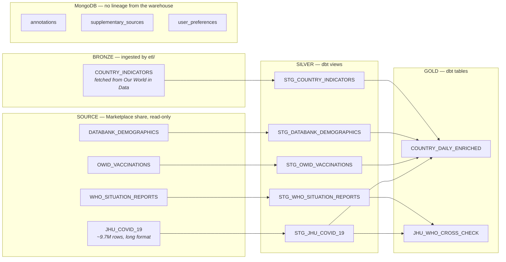

# Relational model — COVID-19 Data Platform

The relational (entity-relationship) model for the database built in the
[COVID-19 Data Integration, Analysis and Visualization Platform](https://github.com/Liq0et-ev/Smt)
project.

That platform stores its data across two systems: a Snowflake warehouse
organised as Medallion layers (Bronze → Silver → Gold), and a MongoDB
database holding user-generated content. Neither of those is a relational
model in the formal sense — the Gold layer is deliberately denormalised for
query speed, and MongoDB is document-shaped. This repository adds the piece
that was missing: a normalised, third-normal-form relational model covering
**both** stores, with declared primary keys, foreign keys and cardinalities.

Contents:

| File | What it is |
|---|---|
| `README.md` | The model itself — diagrams and design decisions |
| `docs/data_dictionary.md` | Column-level reference for every table |
| `ddl/01_relational_model.sql` | `CREATE TABLE` statements with all constraints |
| `ddl/02_load_from_medallion.sql` | Populates the model from the existing Silver layer |
| `ddl/03_integrity_checks.sql` | Referential-integrity validation queries |

---

## 1. What already exists (as-built)

Before the relational model, here is the data the platform actually holds
today, and where each piece comes from:



In Snowflake those layers are `COVID19_PLATFORM.BRONZE`, `.SILVER` and
`.GOLD`; the source share is the separate read-only database
`COVID19_EPIDEMIOLOGICAL_DATA.PUBLIC`. MongoDB has no lineage from the
warehouse at all — it is a parallel store, which is precisely the gap this
model closes.

The Gold layer is a **denormalised mart**: `COUNTRY_DAILY_ENRICHED` repeats
each country's population, GDP and continent on every one of its daily rows.
That is the right choice for a table the API and dashboard scan constantly —
it removes joins from the hot path. It is not, however, a relational model,
and it cannot express the relationship between a country and its annotations,
because those live in MongoDB.

## 2. The relational model

The model below normalises all of it into one schema, `COVID19_PLATFORM.CORE`.
It sits between Silver and Gold: Silver cleans, **Core** models, Gold
denormalises for serving.

```mermaid
erDiagram
    DIM_COUNTRY ||--o| COUNTRY_DEMOGRAPHICS : "measured by"
    DIM_COUNTRY ||--o| COUNTRY_INDICATORS : "described by"
    DIM_COUNTRY ||--o{ FACT_COVID_DAILY : "reports"
    DIM_COUNTRY ||--o{ FACT_VACCINATION_DAILY : "reports"
    DIM_COUNTRY ||--o{ FACT_WHO_SITUATION_REPORT : "reports"
    DIM_COUNTRY ||--o{ ANNOTATION : "subject of"
    DIM_COUNTRY ||--o{ SUPPLEMENTARY_SOURCE : "subject of"
    DIM_COUNTRY ||--o{ USER_PREFERENCE : "default for"

    DIM_DATE ||--o{ FACT_COVID_DAILY : "dates"
    DIM_DATE ||--o{ FACT_VACCINATION_DAILY : "dates"
    DIM_DATE ||--o{ FACT_WHO_SITUATION_REPORT : "dates"
    DIM_DATE ||--o{ ANNOTATION : "dates"

    DIM_METRIC ||--o{ ANNOTATION : "classifies"
    DIM_METRIC ||--o{ USER_FAVORITE_METRIC : "chosen as"
    DIM_SOURCE_TYPE ||--o{ SUPPLEMENTARY_SOURCE : "classifies"

    APP_USER ||--o{ ANNOTATION : "writes"
    APP_USER ||--o{ SUPPLEMENTARY_SOURCE : "adds"
    APP_USER ||--o| USER_PREFERENCE : "has"
    APP_USER ||--o{ USER_FAVORITE_METRIC : "picks"

    ANNOTATION ||--o{ ANNOTATION_TAG : "tagged with"

    DIM_COUNTRY {
        varchar iso_code PK "ISO 3166-1 alpha-2"
        varchar country_name
        varchar continent
    }
    DIM_DATE {
        date date_key PK
        number calendar_year
        number calendar_month
        number iso_week
        boolean is_weekend
    }
    DIM_METRIC {
        varchar metric_code PK
        varchar metric_label
    }
    DIM_SOURCE_TYPE {
        varchar source_type_code PK
        varchar source_type_label
    }
    APP_USER {
        varchar user_id PK
        varchar display_name
        timestamp created_at
    }
    COUNTRY_DEMOGRAPHICS {
        varchar iso_code PK "FK to DIM_COUNTRY"
        number total_population
        number total_male_population
        number total_female_population
    }
    COUNTRY_INDICATORS {
        varchar iso_code PK "FK to DIM_COUNTRY"
        float population_density
        float median_age
        float gdp_per_capita
        float hospital_beds_per_thousand
        float human_development_index
        float life_expectancy
        float diabetes_prevalence
        float extreme_poverty
    }
    FACT_COVID_DAILY {
        varchar iso_code PK "FK to DIM_COUNTRY"
        date report_date PK "FK to DIM_DATE"
        number confirmed_cases
        number confirmed_deaths
        number new_cases
        number new_deaths
    }
    FACT_VACCINATION_DAILY {
        varchar iso_code PK "FK to DIM_COUNTRY"
        date report_date PK "FK to DIM_DATE"
        number total_vaccinations
        number people_vaccinated
        number people_fully_vaccinated
        number daily_vaccinations
        float people_fully_vaccinated_per_hundred
    }
    FACT_WHO_SITUATION_REPORT {
        number who_report_id PK
        varchar iso_code FK
        date report_date FK
        number total_cases
        number cases_new
        number deaths
        number deaths_new
        varchar transmission_classification
    }
    ANNOTATION {
        varchar annotation_id PK
        varchar iso_code FK
        varchar metric_code FK
        date annotation_date FK
        varchar author_user_id FK
        varchar comment_text
        timestamp created_at
        timestamp updated_at
    }
    ANNOTATION_TAG {
        varchar annotation_id PK "FK to ANNOTATION"
        varchar tag PK
    }
    SUPPLEMENTARY_SOURCE {
        varchar source_id PK
        varchar iso_code FK
        varchar source_type_code FK
        varchar added_by_user_id FK
        varchar title
        varchar url
        varchar description
        timestamp created_at
    }
    USER_PREFERENCE {
        varchar user_id PK "FK to APP_USER"
        varchar default_country_iso FK
        varchar theme
        timestamp updated_at
    }
    USER_FAVORITE_METRIC {
        varchar user_id PK "FK to APP_USER"
        varchar metric_code PK "FK to DIM_METRIC"
    }
```



### Entity catalogue

| Entity | Grain — one row per… | Primary key | Comes from |
|---|---|---|---|
| `DIM_COUNTRY` | country | `iso_code` | new — conformed from all Silver models |
| `DIM_DATE` | calendar day | `date_key` | new — generated |
| `DIM_METRIC` | annotatable metric | `metric_code` | new — from the MongoDB `metric` enum |
| `DIM_SOURCE_TYPE` | source category | `source_type_code` | new — from the `source_type` enum |
| `APP_USER` | person using the platform | `user_id` | new — from `author` / `user_id` strings |
| `COUNTRY_DEMOGRAPHICS` | country | `iso_code` | `STG_DATABANK_DEMOGRAPHICS` |
| `COUNTRY_INDICATORS` | country | `iso_code` | `STG_COUNTRY_INDICATORS` |
| `FACT_COVID_DAILY` | country × day | `iso_code, report_date` | `STG_JHU_COVID_19` |
| `FACT_VACCINATION_DAILY` | country × day | `iso_code, report_date` | `STG_OWID_VACCINATIONS` |
| `FACT_WHO_SITUATION_REPORT` | WHO report line | `who_report_id` | `STG_WHO_SITUATION_REPORTS` |
| `ANNOTATION` | user comment | `annotation_id` | MongoDB `annotations` |
| `ANNOTATION_TAG` | tag on a comment | `annotation_id, tag` | MongoDB `annotations.tags[]` |
| `SUPPLEMENTARY_SOURCE` | external source | `source_id` | MongoDB `supplementary_sources` |
| `USER_PREFERENCE` | user | `user_id` | MongoDB `user_preferences` |
| `USER_FAVORITE_METRIC` | user × metric | `user_id, metric_code` | MongoDB `user_preferences.favorite_metrics[]` |

---

## 3. Design decisions

**`iso_code` is the single join key across the whole model.** Every source
table in the platform carries ISO 3166-1 natively, so no country-name matching
is needed anywhere — "United States" vs "US" never has to be reconciled. The
code is **alpha-2** (`US`, not `USA`), because that is what the Marketplace
tables use; the Bronze ETL already converts OWID's alpha-3 codes to alpha-2 on
ingest so the invariant holds everywhere.

**`DIM_COUNTRY` is the conformed dimension that the as-built warehouse never
had.** Today, country attributes are split across two Silver models —
population in `STG_DATABANK_DEMOGRAPHICS`, everything else in
`STG_COUNTRY_INDICATORS` — and the country's *name* is carried redundantly on
every fact row. Extracting one `DIM_COUNTRY` removes that redundancy and gives
every other table a single foreign-key target.

**Country attributes stay in two 1:1 tables rather than being folded into
`DIM_COUNTRY`.** `COUNTRY_DEMOGRAPHICS` and `COUNTRY_INDICATORS` have different
sources, different refresh cadences and different completeness — 216 countries
have demographics, fewer have a human development index. Keeping them separate
makes "this country has no indicators" representable as a missing row instead
of eight nulls, and means re-running one ETL doesn't touch the other's data.

**`FACT_COVID_DAILY` stores both cumulative and daily figures.** The source is
cumulative; almost every consumer (forecasting, wave detection, the dashboard's
daily charts) immediately differences it. Computing `new_cases` once at load
time, rather than in each consumer, avoids repeating the window function.
The stored delta is **signed** — negative values are kept, not clipped to
zero, because the project's own EDA established that negative deltas are
legitimate reporting corrections rather than errors. Consumers that need a
non-negative series clip it themselves, as the forecasting module does.

**`FACT_WHO_SITUATION_REPORT` gets a surrogate key.** The other two facts are
uniquely identified by (country, date), and dbt tests assert this. The WHO
staging model asserts no such uniqueness and does not filter out rows with a
null `iso_code`, so (country, date) cannot serve as a primary key here. A
surrogate `who_report_id` keeps the table addressable without pretending to a
grain the data doesn't have. This is a genuine difference between the sources,
not an inconsistency in the model.

**MongoDB's arrays become child tables.** `tags` and `favorite_metrics` are
arrays inside a document; a relational model in first normal form cannot store
a repeating group in a column, so each becomes its own table keyed on the
parent plus the value. This is the one place where the relational model is
meaningfully *more* constrained than the document model — which is exactly why
the platform keeps MongoDB for that content and treats these tables as a
queryable projection of it.

**Enumerated values become dimension tables where they are analytically
useful.** `metric` and `source_type` get `DIM_METRIC` and `DIM_SOURCE_TYPE`,
because both are filtered and grouped on — the dashboard filters annotations
per chart by metric. `theme` (`light`/`dark`) does not get a dimension table;
it is a UI setting that is never an analytical axis, so a documented domain
plus a validation test is enough.

### A note on constraint enforcement in Snowflake

Snowflake accepts full `PRIMARY KEY` / `UNIQUE` / `FOREIGN KEY` syntax but
**only enforces `NOT NULL`**. The other constraints are metadata: they
document intent, they let ERD tools reverse-engineer the diagram above from
the live database, and — when declared `RELY`, as they are here — they let the
query optimiser eliminate provably unnecessary joins. They will not reject bad
data.

Snowflake also has no `CHECK` constraints at all.

So the model's integrity is guaranteed in two other places, both of which the
platform already uses:

1. **dbt schema tests** — `unique_combination_of_columns`, `not_null`,
   `accepted_range` and `accepted_values` already guard the Silver and Gold
   models. `relationships` tests extend the same approach to the foreign keys
   declared here.
2. **`ddl/03_integrity_checks.sql`** — anti-join queries that return any
   orphaned or duplicated row. Run after each load; every query should return
   zero rows.

Declaring `RELY` on a key that is not actually unique will produce wrong query
results, because the optimiser trusts it. That is safe here only because the
uniqueness is independently tested rather than assumed.

---

## 4. Running it

Against the `COVID19_PLATFORM` database, with `COVID_WH` as the warehouse:

```sql
-- 1. Create the schema and all tables
!source ddl/01_relational_model.sql

-- 2. Populate from the existing Silver layer (requires `dbt run` to have run)
!source ddl/02_load_from_medallion.sql

-- 3. Verify referential integrity — every query should return zero rows
!source ddl/03_integrity_checks.sql
```

Or paste each file into a Snowsight worksheet in that order.

Both `01` and `02` are re-runnable. `01` drops and recreates the tables —
children first, because Snowflake refuses to drop a table another table
references by a foreign key — so re-running it discards `CORE`'s contents and
`02` has to run again after it. `02` uses `INSERT OVERWRITE` throughout, so it
replaces rather than appends and can be re-run on its own whenever the Silver
models are rebuilt.

Nine of the fifteen tables load entirely from SQL. The six that mirror MongoDB
— `APP_USER`, `ANNOTATION`, `ANNOTATION_TAG`, `SUPPLEMENTARY_SOURCE`,
`USER_PREFERENCE` and `USER_FAVORITE_METRIC` — cannot: their data lives in a
different database engine, so they are populated by a sync job that reads the
collections, flattens the array fields, and merges the result in. The load
script documents the shape of that merge rather than inventing a SQL-only path
that could not work.
